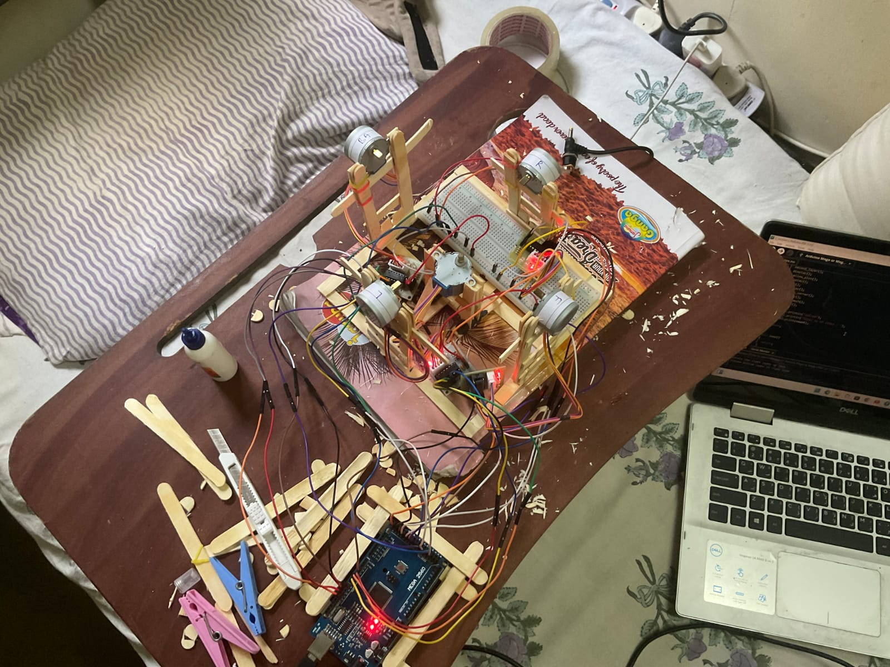
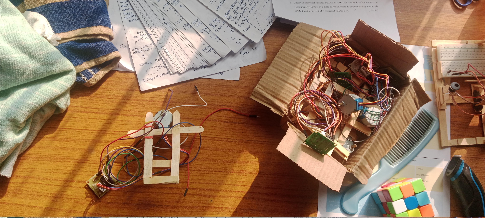
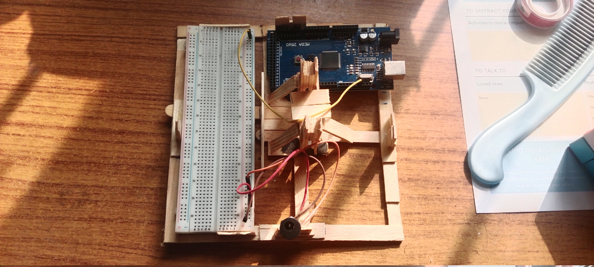

# Erno Enigma

This project (Erno Enigma - 3 by 3 Rubiks Cube Solver) was done in the second semester and the idea was to be able to solve a 3*3 rubiks cube from the state at which it is (which is scrambled). And the code is written entirely in C. After the the code was made, an attempt was made to use it in <b>Arduino based rubiks cube solver</b>.

Given below is the image of it.

Given below are the components used to make the proejct.

<table>
  <thead>
    <tr>
      <th>Components</th>
      <th>Purpose</th>
    </tr>
  </thead>
  <tbody>
    <tr>
      <td>Stepper motor</td>
      <td>There are six faces in Rubiks cube and it is theoritically possible to rotate just five faces and solve the rubiks cube. The code <b>Erno's Enigma</b> only rotates five faces of rubisk cube to solve it, hence five stepper motors were sued.. A stepper motor could be roated to any degree, any number of tiems. And therefore this was used to in the project to rotate the fac es of rubik's cube.</td>
    </tr>
    <tr>
      <td>5V Voltage Regulator</td>
      <td>The stepper motors used worked on 5V voltage and thus the regulators. Indian Voltage reguilation provides with 220V of AC current. And this has to be convetred to 5V DC current before using it to power the stepper motor.</td>
    </tr>
    <tr>
      <td>Arduino Mega</td>
      <td>Arduino mega was used with the memeory of code kept in mind.</td>
    </tr>
    <tr>
      <td>Ice Cream Sticks</td>
      <td>This was choosen as a cheap alternative to 3D printed components for making the structure of rubisk cube solver. The structure holded the stepper motor whcih holded the faces of rubiks cube. It also have space for adjusting the micro-processor and wires involved (along witht he bread board). Stands to hold the motors on the sides and thign that attached the motors with rubiks cube faces where also made using ice cream sticks and stepper motors.</td>
    </tr>
  </tbody>
</table>

  The projects did not turned out well due to 
  <ol>
    <li>High friction fo rubiks cube. Eevry turned however simple and effortless it might seem using hands, but was tough and rouhg on the stepper motors.</li>
    <li>Weak Stepper motors. The stepper motors used were of <b>abc</b>, and they were weak for the project.</li>
    <li>Weak and fragile Structures. The structure was made using the ice cream sticks and many estimations. It wasnt perfect. And hence this could be the biggest reason the project didn't do well.</li>
  </ol>

But in future I would love to resume my work on making this Arduino based rubiks cueb solver with better robust structures, accurate and powerful mototrs, and more efficient algorithm to solve Rubik's cube.

  <h2>Wooden stand to hold the motors.</h2> 
  
  

  <h2>Base of the structure</h2> 
  
  

